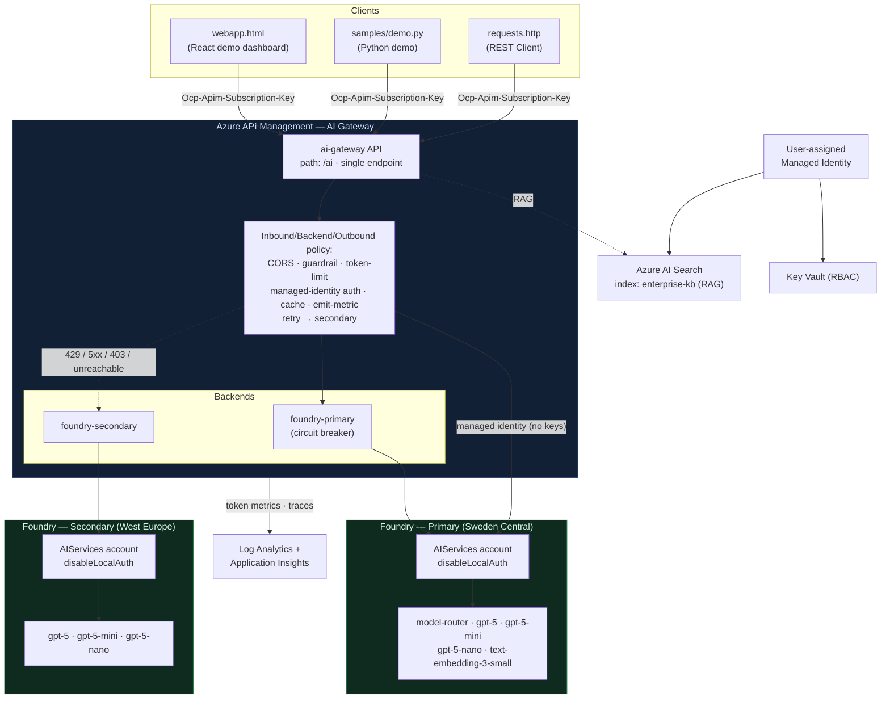
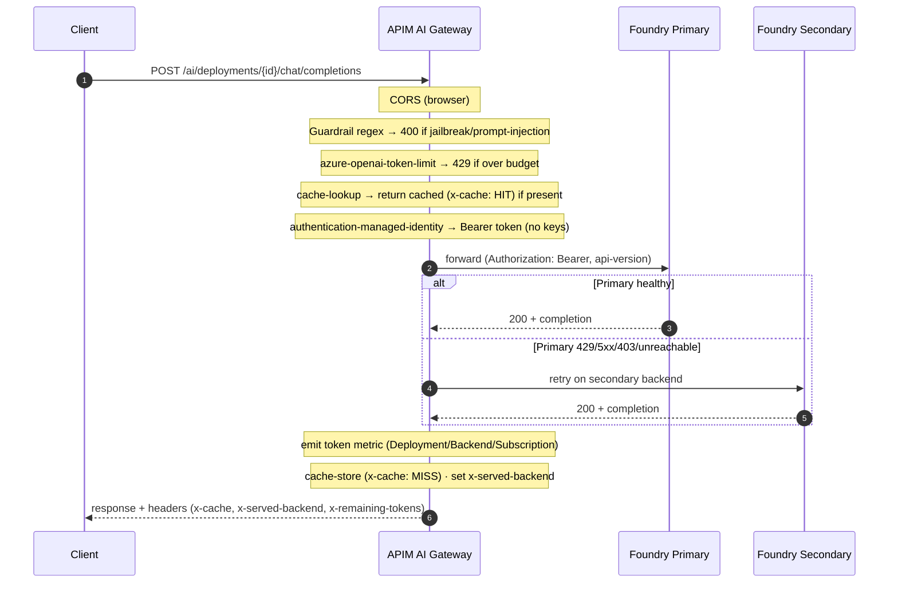
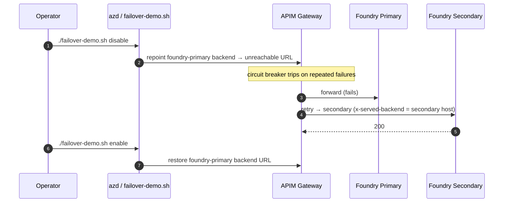

# Architecture

The demo exposes an enterprise **AI Gateway** — a single, governed HTTPS endpoint on
**Azure API Management (APIM)** in front of **Azure AI Foundry v2** (Azure OpenAI) across
two regions. Clients never talk to Foundry directly; the gateway centrally enforces model
abstraction, safety, token governance, caching, observability and multi-region failover.

Everything is provisioned by a single self-contained `main.bicep` via `azd` — no manual
Azure Portal steps.

## System overview

## Request lifecycle

## Multi-region failover

> The native `model-router` is only offered in Sweden Central among EU-residency regions,
> so it is deployed in the **primary** region only. Failover therefore uses a concrete
> model present in both regions (`gpt-5-mini`). Set `routerInSecondary=true` if your
> secondary region offers the router.

## Components (all in `main.bicep`, resourceGroup-scoped)

| Resource | Role |
| --- | --- |
| Log Analytics + Application Insights | Observability backbone (token metrics, traces) |
| User-assigned managed identity | App-tier identity (Search + Key Vault) |
| Key Vault (RBAC) | Demo secret store (e.g. APIM subscription key) |
| Azure AI Foundry (AIServices) ×2 | Primary + secondary regions, `disableLocalAuth: true` |
| Model deployments | `model-router` (primary), `gpt-5` / `gpt-5-mini` / `gpt-5-nano` (both), `text-embedding-3-small` (primary) |
| Azure AI Search | Enterprise knowledge grounding (RAG), index `enterprise-kb` |
| API Management (Developer) | The AI Gateway — single endpoint + policy + backends |
| Role assignments | APIM→Foundry (Cognitive Services OpenAI User), app→Search / Key Vault |

## Gateway policy pipeline

The single API policy (built inline in `main.bicep`) runs, in order:

| Stage | Policy | Purpose |
| --- | --- | --- |
| inbound | `cors` | Let the browser client call the gateway and read custom headers |
| inbound | `set-variable deployment-id` | Default to the native router when no model is specified |
| inbound | guardrail `choose` + `return-response` | Block prompt-injection / jailbreak → `400` |
| inbound | `azure-openai-token-limit` | Per-subscription tokens-per-minute budget → `429` |
| inbound | `cache-lookup-value` | Return cached response → `x-cache: HIT` |
| inbound | `authentication-managed-identity` | Bearer token to Foundry (no keys) |
| inbound | `set-backend-service foundry-primary` | Start on the primary region |
| inbound | `azure-openai-emit-token-metric` | Token metrics to Application Insights |
| backend | `retry` + `set-backend-service foundry-secondary` | Failover on unreachable/403/429/5xx |
| outbound | `cache-store-value` | Populate cache → `x-cache: MISS` |
| outbound | `set-header x-served-backend` | Expose which region answered |

## Managed identity flow

APIM has a system-assigned identity granted **Cognitive Services OpenAI User** on both
Foundry accounts. The inbound policy calls
`authentication-managed-identity resource="https://cognitiveservices.azure.com"` and sets
the `Authorization: Bearer` header — so **no API keys** are used or stored. Foundry
accounts have `disableLocalAuth: true`.

## Configuration & regions

- Primary region defaults to **Sweden Central**, secondary to **West Europe** (both
  EU-residency compliant).
- Model names are **never hardcoded** in logic — they flow from the `chatModelDeployments`
  parameter in `main.bicep` to the clients via `azd` outputs.
- See [CONFIGURATION.md](CONFIGURATION.md) for overrides, fallbacks and semantic caching.

## Design notes

- **Single self-contained template.** `main.bicep` is `resourceGroup`-scoped; `azd`
  creates the resource group and provisions everything with `azd provision`.
- **Built-in cache** (hash of the prompt) is used for zero-secret response caching; swap
  to `azure-openai-semantic-cache-*` with Azure Cache for Redis for true semantic caching.
- **Guardrail** is a lightweight regex for the demo; replace with the `llm-content-safety`
  policy backed by Azure AI Content Safety for production.
