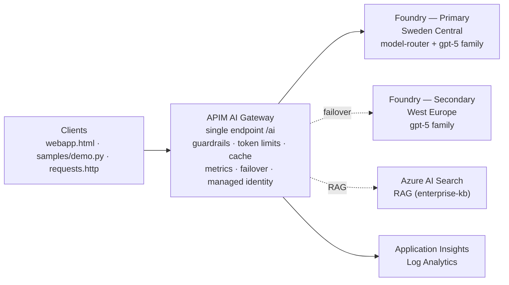

# Azure AI Gateway Demo

An end-to-end, **infrastructure-as-code** demo of an enterprise **AI Gateway** built on
**Azure API Management** in front of **Azure AI Foundry v2** (Azure OpenAI). It showcases
the capabilities platform teams need to safely expose generative AI to the enterprise
through a **single, governed endpoint**:

- **Model abstraction** — one endpoint, many models; clients never change URLs.
- **Native Foundry model router** — Foundry selects the best underlying model per prompt.
- **Token governance** — per-subscription tokens-per-minute budgets (`HTTP 429`).
- **Guardrails** — prompt-injection / jailbreak requests blocked at the gateway (`HTTP 400`).
- **Response caching** — repeat prompts return instantly (`x-cache: HIT`).
- **Multi-region failover** — automatic retry to a secondary region on throttling/5xx.
- **Managed identity everywhere** — no API keys in code or config.
- **Observability** — token metrics, latency and routing in Application Insights.
- **RAG** — enterprise knowledge grounding with Azure AI Search.

Everything is provisioned with a single self-contained `main.bicep` via `azd` — **no
manual Azure Portal steps**.

---

## Architecture



The full component list, request-lifecycle and failover **sequence diagrams**, the policy
pipeline and the managed-identity flow are in [ARCHITECTURE.md](ARCHITECTURE.md).

---

## Prerequisites

| Tool | Purpose |
| --- | --- |
| [Azure Developer CLI (`azd`)](https://aka.ms/azd) | Provisioning |
| [Azure CLI (`az`)](https://learn.microsoft.com/cli/azure/install-azure-cli) | Model checks + subscription key |
| Python 3.10+ | Running `samples/demo.py` |
| An Azure subscription | With quota for Azure OpenAI + APIM |

You also need **Cognitive Services / Azure OpenAI quota** for the `gpt-5` family and
`model-router` in your primary region.

---

## Quick start

### Option A — one-command script

```powershell
# Windows / PowerShell
./deploy.ps1
```

```bash
# macOS / Linux
./deploy.sh
```

The script logs in with `azd`, creates the `ai-gateway-demo` environment, provisions
everything, then prints the gateway URL and APIM subscription key.

### Option B — azd directly

```bash
azd auth login
azd env new ai-gateway-demo
azd env set AZURE_LOCATION swedencentral
azd env set SECONDARY_LOCATION westeurope
azd provision
```

> **Timing:** APIM (Developer SKU) provisioning typically takes ~30–45 minutes. Foundry,
> model deployments, Search and Key Vault complete in a couple of minutes.

### Get the connection details

```bash
azd env get-value APIM_GATEWAY_URL

az apim subscription show \
  --resource-group $(azd env get-value AZURE_RESOURCE_GROUP) \
  --service-name  $(azd env get-value APIM_SERVICE_NAME) \
  --sid ai-gateway-demo --query primaryKey -o tsv
```

---

## Try it

### Python feature demo (no dependencies)

```bash
python samples/demo.py --from-azd
```

Runs all six scenarios and prints the gateway headers that prove each capability
(`x-cache`, `x-remaining-tokens`, `x-served-backend`, HTTP `400`/`429`). Run a single
scenario with `--only <name>`. See [samples/README.md](samples/README.md).

### Browser client

Open [webapp.html](webapp.html) (a single-file React app — no build step) and paste the
gateway URL and subscription key. It has three tabs:

- **Chat playground** — pick any deployment or the native router, toggle RAG, and see the
  served model, `x-cache`, `x-served-backend`, token and latency badges per message.
- **Feature demos** — one-click cards for model abstraction, native routing, guardrails
  (`400`), caching (`MISS`→`HIT`), token governance (`429`), and multi-region failover.
- **Activity log** — a live table of every request with status, cache, backend, remaining
  tokens and latency.

> The gateway enables CORS so the browser can call it directly and read the custom demo
> headers. Scope the allowed origins for production.

### REST client

Open [requests.http](requests.http) in VS Code (REST Client extension), set `@gateway`
and `@key`, and send the sample requests.

---

## Model catalog (configuration-driven)

No model names are hardcoded in application logic — they flow from the
`chatModelDeployments` parameter in `main.bicep` to the app via `azd` outputs.

| Deployment | Model | Region(s) | Purpose |
| --- | --- | --- | --- |
| `model-router` | `model-router` (2025-11-18) | Primary only¹ | Native Foundry routing |
| `gpt-5` | `gpt-5` (2025-08-07) | Primary + Secondary | Balanced |
| `gpt-5-mini` | `gpt-5-mini` (2025-08-07) | Primary + Secondary | Fast / cheap |
| `gpt-5-nano` | `gpt-5-nano` (2025-08-07) | Primary + Secondary | Ultra-low latency |
| `text-embedding-3-small` | embeddings (v1) | Primary | Semantic-cache lookups |

¹ The native `model-router` is only offered in Sweden Central among EU-residency regions,
so it is deployed in the **primary** region only. Multi-region **failover** therefore uses
a concrete model present in both regions (`gpt-5-mini`). Set `routerInSecondary=true` if
your secondary region offers the router.

> **No Mistral is used anywhere in this demo** — only Microsoft/OpenAI models exposed
> through Azure AI Foundry.

Override models, versions, regions and budgets without touching business logic — see
[CONFIGURATION.md](CONFIGURATION.md).

---

## Demo walkthrough

A ~15-minute stakeholder script is in [DEMO_RUNBOOK.md](DEMO_RUNBOOK.md), covering model
abstraction, routing, token governance, guardrails, caching, failover, RAG and
observability.

### Multi-region failover

```bash
python samples/demo.py --from-azd --only failover   # note x-served-backend
./failover-demo.sh disable                            # simulate primary outage
python samples/demo.py --from-azd --only failover   # backend flips to secondary
./failover-demo.sh enable                             # restore the primary
```

---

## Repository layout

| Path | Description |
| --- | --- |
| `main.bicep` | Self-contained, resourceGroup-scoped infrastructure |
| `main.parameters.json` | azd → Bicep parameter bindings |
| `azure.yaml` | azd project definition (infra-only) |
| `deploy.ps1` / `deploy.sh` | One-command provisioning wrappers |
| `samples/demo.py` | Python feature demo (stdlib only) |
| `samples/README.md` | Python demo guide |
| `webapp.html` | Single-file React demo dashboard (Chat · Feature demos · Activity log) |
| `requests.http` | REST Client sample requests |
| `failover-demo.sh` | Simulates a primary-region outage (backend swap) |
| `enterprise-kb.sample.md` | Sample RAG knowledge base |
| `.github/workflows/azure-dev.yml` | CI/CD pipeline (azd provision, default Sweden Central) |
| `ARCHITECTURE.md` | Architecture, diagrams & design |
| `CONFIGURATION.md` | Configuration / model overrides |
| `DEMO_RUNBOOK.md` | Stakeholder walkthrough |
| `CICD.md` | GitHub Actions + azd pipeline |

---

## Security notes

- **No secrets in source.** Service-to-service auth uses **managed identity**; the APIM
  subscription key is generated at deploy time and fetched on demand via `az`.
- APIM authenticates to Foundry with `authentication-managed-identity` (no OpenAI keys).
- Foundry accounts have `disableLocalAuth: true`.
- The bundled guardrail is a lightweight regex filter — for production, replace it with
  the `llm-content-safety` policy backed by Azure AI Content Safety (see
  [CONFIGURATION.md](CONFIGURATION.md)).

---

## Clean up

```bash
azd down --purge --force-and-purge
```

This deletes the resource group and purges soft-deleted Foundry/Key Vault resources.
